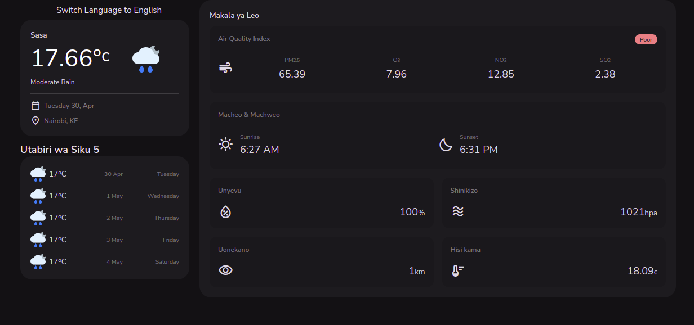
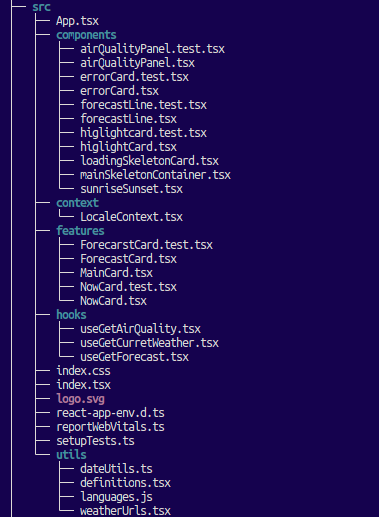

## Weather app for Fuzu asessment

### Features & Technologies
- Responsive
- Typescript for additional type safety
- Skeleton loading components to indicate loading state
- Unit tests with react testing library 

The website is powered by openweather api, to run the api simply clone the repository and run  `npm ci` then `npm start

The app makes three api calls to populate the page, one for current weather, one for air quality and one for the forecast. Loading indicators are used to indicate when the page is fetching data. 

## Directory structure

components is where the reusable ui goes, features are for major sections of the webpage, reusable functional code that is not jsx goes into utils. I decided to go with plain css for styling as it is simple and effective  

## Tests
to run the unit tests, type `npm run test`